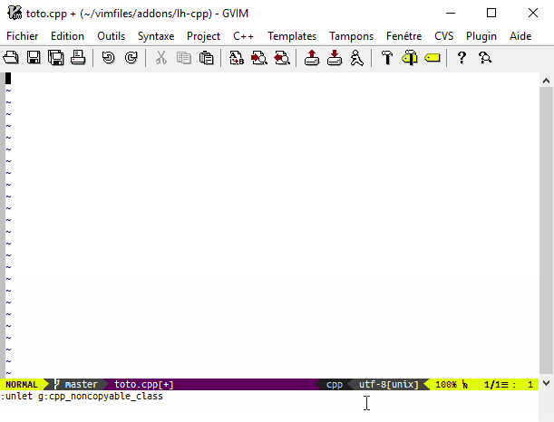

# lh-cpp Snippets, templates and wizards

## Contents

  * [Remarks](#remarks)
  * [Control Statements](#control-statements)
      * [cpp/catch](#cppcatch)
      * [cpp/for-enum](#cppfor-enum)
      * [cpp/for-iterator](#cppfor-iterator)
      * [cpp/for-range](#cppfor-range)
      * [cpp/fori](#cppfori)
      * [cpp/foriN](#cppforin)
      * [cpp/namespace](#cppnamespace)
      * [cpp/throw](#cppthrow)
      * [cpp/try](#cpptry)
      * [cpp/while-getline](#cppwhile-getline)
  * [Standard (and boost) Types](#standard-and-boost-types)
      * [cpp/auto_ptr](#cppauto_ptr)
      * [cpp/auto_ptr-instance](#cppauto_ptr-instance)
      * [cpp/file](#cppfile)
      * [cpp/list](#cpplist)
      * [cpp/map](#cppmap)
      * [cpp/noncopyable](#cppnoncopyable)
      * [cpp/path](#cpppath)
      * [cpp/ptr_vector](#cppptr_vector)
      * [cpp/set](#cppset)
      * [cpp/shared_ptr](#cppshared_ptr)
      * [cpp/string](#cppstring)
      * [cpp/unique_ptr](#cppunique_ptr)
      * [cpp/vector](#cppvector)
      * [cpp/weak_ptr](#cppweak_ptr)
  * [Standard (and boost) Functions and Idioms](#standard-and-boost-functions-and-idioms)
      * [c/assert](#cassert)
      * [c/rand_init](#crand_init)
      * [c/realloc](#crealloc)
      * [cpp/array_size](#cpparray_size)
      * [cpp/internals/get-b-e](#cppinternalsget-b-e)
      * [cpp/b-e](#cppb-e)
      * [cpp/cerr](#cppcerr)
      * [cpp/cin](#cppcin)
      * [cpp/copy](#cppcopy)
      * [cpp/copy-back_inserter](#cppcopy-back_inserter)
      * [cpp/cout](#cppcout)
      * [cpp/ends_with](#cppends_with)
      * [cpp/erase-remove](#cpperase-remove)
      * [cpp/forward](#cppforward)
      * [cpp/iss](#cppiss)
      * [cpp/oss](#cpposs)
      * [cpp/sort](#cppsort)
      * [cpp/starts_with](#cppstarts_with)
      * [cpp/static_assert](#cppstatic_assert)
      * [cpp/typeid](#cpptypeid)
  * [Classes](#classes)
    * [Class Elements](#class-elements)
      * [cpp/assignment-operator](#cppassignment-operator)
      * [cpp/bool-operator](#cppbool-operator)
      * [cpp/copy-and-swap](#cppcopy-and-swap)
      * [cpp/copy-constructor](#cppcopy-constructor)
      * [cpp/default-constructor](#cppdefault-constructor)
      * [cpp/destructor](#cppdestructor)
      * [cpp/operator-binary](#cppoperator-binary)
      * [cpp/stream-extractor](#cppstream-extractor)
      * [cpp/stream-inserter](#cppstream-inserter)
    * [Class Patterns](#class-patterns)
      * [cpp/abs-rel](#cppabs-rel)
      * [cpp/abstract-class](#cppabstract-class)
      * [cpp/base-class](#cppbase-class)
      * [cpp/base-class-non-virtual](#cppbase-class-non-virtual)
      * [cpp/class](#cppclass)
      * [cpp/empty-exception-class](#cppempty-exception-class)
      * [cpp/enum](#cppenum)
      * [cpp/enum2](#cppenum2)
      * [cpp/enum2-impl](#cppenum2-impl)
      * [cpp/exception-class](#cppexception-class)
      * [cpp/singleton](#cppsingleton)
      * [cpp/traits](#cpptraits)
  * [Doxygen](#doxygen)
      * [dox/author](#doxauthor)
      * [dox/code](#doxcode)
      * [dox/em](#doxem)
      * [dox/file](#doxfile)
      * [dox/function](#doxfunction)
      * [dox/group](#doxgroup)
      * [dox/html](#doxhtml)
      * [dox/ingroup](#doxingroup)
      * [dox/since](#doxsince)
      * [dox/tt](#doxtt)
  * [Miscellaneous](#miscellaneous)
      * [c/comment](#ccomment)
      * [cpp/benchmark](#cppbenchmark)
      * [cpp/otb-sug-latex](#cppotb-sug-latex)
      * [cpp/otb-sug-snippet](#cppotb-sug-snippet)
      * [cpp/utf8](#cpputf8)
  * [Internal templates](#internal-templates)
      * [cpp/internals/abs-rel-shared](#cppinternalsabs-rel-shared)
      * [cpp/internals/class-skeleton](#cppinternalsclass-skeleton)
      * [cpp/internals/formatted-comment](#cppinternalsformatted-comment)
      * [cpp/internals/function-comment](#cppinternalsfunction-comment)
      * [cpp/internals/stream-common](#cppinternalsstream-common)
      * [cpp/internals/stream-implementation](#cppinternalsstream-implementation)
      * [cpp/internals/stream-signature](#cppinternalsstream-signature)

## Remarks

 * Styling options from
   [lh-dev](http://github.com/LucHermitte/lh-dev#options-1) are applied on the
   snippets. In other words, the code presented here may be formatted
   differently regarding spaces and newlines.

 * [Placeholders](http://github.com/LucHermitte/lh-brackets) are represented
   within «French quotation marks».

 * Default snippets from
   [mu-template](http://github.com/LucHermitte/mu-template) aren't documented
   yet.

 * About variation points ... TBD
 * About so called snippet _parameter_ ... TBD
 * About surrounding numbers ... TBD

## Control Statements
#### cpp/catch
**Produces:**
```C++
catch(«...») {
    «catch-code»
}
```

**Surround:**
  1. The selection can be surrounded to become the catch-code

#### cpp/for-enum
**Produces:**
```C++
for («Enum»::type «exception_type»(«exception_args»)=«Enum»::type()
   ; «exception_type»(«exception_args»)!=«Enum»::MAX__
   ; ++«exception_type»(«exception_args»))
{
    «code»
}
```

**Surround:**
  1. The selection can be surrounded to become the loop code

**Note:**
  *  This snippet is meant to be used with [cpp/enum](#cppenum) snippets

#### cpp/for-iterator
**Produces:**
```C++
for («clsname»::«const_»iterator «b»=«cont»begin(), «exception_type»(«exception_args»)=«cont».end()
    ; «b»!=«exception_type»(«exception_args»)
    ; ++«b»)
{
    «code»
}
```

**Surround:**
  1. The selection can be surrounded to become the loop code

**Notes:**
  *  Container name («cont»), and iterators names («b» and «exception_type»(«exception_args»)) are asked to the end user

#### cpp/for-range
**Produces:**
```C++
for («type» «elem» : «range») {
    «code»
}
```

**Parameters:**
  * _type_, default: `auto&&`
  * _elem_, default: `e`
  * _range_, default: `«range»`

**Surround:**
  1. The selection can be surrounded to become the loop code

**To do:**
  * Have _type_ default to nothing in C++17

#### cpp/fori
**Produces:**
```C++
for («int» «i»=0;«i»!=«N»;++«i») {
    «code»
}
```

**Surround:**
  1. The selection can be surrounded to become the loop code

#### cpp/foriN
**Produces:**
```C++
for («std::size_t» «i»=0, «N»=...;«i»!=«N»;++«i») {
    «code»
}
```

**Surround:**
  1. The selection can be surrounded to become the loop code

#### cpp/namespace
**Produces:** `namespace «ns» { ... } // «ns»`

**Parameters:**
  * _ns_, default: `(bg):[{ft}_]project_namespace`

**Options:**
  * [`(bg):[{ft}_]project_namespace`](options.md#bgft_project_namespace), which
    defaults to `«ns»`
  * [`lh#cpp#use_cpp17()`](options.md#bgcpp_std_flavour)
  * [`(bg):cpp_use_nested_namespaces`](options.md#bgcpp_use_nested_namespaces)

**Surround:**
  1. The selection can be surrounded to become the namespace code

**Notes:**
  * If the namespace parameter is `foo::bar`, this snippet produces two nested
    namespace definitions.
  * If C++17 flavour is selected, and `(bg):cpp_use_nested_namespaces` is true,
    then a C++17 _nested namespace_ will be used.

#### cpp/throw
**Produces:**
  * `throw «exception_type»(«exception_args»);«»` (within code context)
  * or `@throw «exception_type»«»` (within Doxygen comments)

**Parameters:**
  * `exception_text`, default: cpp/internals/formatted-comm

**Options:**
  * `(bg):({ft}_)exception_type`, default: `std:runtime_error`
  * `(bg):({ft}_)exception_args`, default: `v:1_`, functor that gets `exception_txt` injected as parameter. A typical value would be:

  ```vim
:let b:exception_args = 'v:1_.lh#marker#txt(", ".b:cpp_project_namespace."::ExitCode::")'
  ```
  Note that this expression dynamically adapts to the current
  `b:cpp_project_namespace`, and to the current marker characters.
  *  Doxygen related options:
    * [`(bg):({ft_}dox_TagLeadingChar)`](options.mg#bgft_dox_tagleadingchar)
    * [`(bg):({ft_}dox_throw)`](options.mg#bgft_dox_throw)

**Relies on:**
  * [`lh#dox#tag()`](API.md#lhdoxtag)
  * [`lh#dox#throw()`](API.md#lhdoxthrow)

**Also includes:**
  * `<stdexcept>` if `exception_type` starts with `std::`

#### cpp/try
**Produces:**
```C++
try {
    «code»
} catch(«std::exception const& e») {
    «catch-code»
}
```

**Surround:**
  1. The selection can be surrounded to become the try-code
  2. The selection can be surrounded to become the catch-code

#### cpp/while-getline
**Produces:**
```C++
while(std::getline(«stream»,«line»)) {
    «code»;
}
```

**Surround:**
  1. The selection can be surrounded to become the loop code

**Also includes:**
  * `<string>`


## Standard (and boost) Types
#### cpp/auto_ptr
**Produces:** `std::auto_ptr<«type»>`

**Surround:**
  1. The selection can be surrounded to become the value type

**Also includes:**
  * `<memory>`

#### cpp/auto_ptr-instance
**Produces:** `std::auto_ptr<«type»> ptr(new «type»(args));`

**Surround:**
  1. The selection can be surrounded to become the value type

**Also includes:**
  * `<memory>`

**Notes:**
  * I hesitate to called it `cpp/make_auto_ptr`

#### cpp/file
**Produces:** `«i»fstream f(«filename»);`

**Surround:**
  1. The selection can be surrounded to become the filename

**Also includes:**
  * `<fstream>`

#### cpp/list
**Produces:** `std::list<«type»> «»`

**Surround:**
  1. The selection can be surrounded to become the value type

**Also includes:**
  * `<list>`

#### cpp/map
**Produces:** `std::map<«key»,«value»> «»`

**Surround:**
  1. The selection can be surrounded to become the value type
  2. The selection can be surrounded to become the key type

**Also includes:**
  * `<map>`

#### cpp/noncopyable
**Produces:** `boost::noncopyable`

**Also includes:**
  * `<boost/noncopyable.hpp>`

#### cpp/path
**Produces:** `boost::filesystem::path`

**Also includes:**
  * `<boost/filesystem.hpp>`

#### cpp/ptr_vector
**Produces:** `boost::ptr_vector<«type»> «»`

**Surround:**
  1. The selection can be surrounded to become the value type

**Also includes:**
  * `<boost/ptr_container/ptr_vector.hpp>`

#### cpp/set
**Produces:** `std::set<«type»> «»`

**Surround:**
  1. The selection can be surrounded to become the value type

**Also includes:**
  * `<set>`

#### cpp/shared_ptr
**Produces:**
  * `std::shared_ptr<«type»> «»`, in [C++11 or more](options.md#bgcpp_std_flavour)
  * `boost::shared_ptr<«type»> «»`, otherwise

**Options:**
  * [`lh#cpp#use_cpp11()`](options.md#bgcpp_std_flavour)

**Surround:**
  1. The selection can be surrounded to become the value type

**Also includes:**
  * `<memory>` in C++11
  * `<boost/shared_ptr.hpp>` otherwise

#### cpp/string
**Produces:** `std::string «»`

**Also includes:**
  * `<string>`

#### cpp/unique_ptr
**Produces:** `std::unique_ptr<«type»>`

**Surround:**
  1. The selection can be surrounded to become the value type

**Also includes:**
  * `<memory>`

#### cpp/vector
**Produces:** `std::vector<«type»> «»`

**Surround:**
  1. The selection can be surrounded to become the value type

**Also includes:**
  * `<vector>`

#### cpp/weak_ptr
**Produces:**
  * `std::weak_ptr<«type»> «»`, in [C++11 or more](options.md#bgcpp_std_flavour)
  * `boost::weak_ptr<«type»> «»`, otherwise

**Options:**
  * [`lh#cpp#use_cpp11()`](options.md#bgcpp_std_flavour)

**Surround:**
  1. The selection can be surrounded to become the value type

**Also includes:**
  * `<memory>` in C++11
  * `<boost/shared_ptr.hpp>` otherwise


## Standard (and boost) Functions and Idioms
#### c/assert
**Produces:** `assert(«assertion»)`

**Surround:**
  1. The selection can be surrounded to become the «assertion»

**Also includes:**
  * `<assert.h>` in C, `<cassert>` in C++

#### c/rand_init
**Produces:** `srand(time(NULL));`

**Also includes:**
  * `<time.h>` in C, `<ctime>` in C++
  * `<stdlib.h>` in C, `<cstdlib>` in C++

#### c/realloc
**Produces:**
```C++
type lhs = (type) realloc(ptr, size); macro
if (! lhs) {                          macro
    free(ptr);                        macro
    ptr = NULL;                       macro
    count = 0;                        macro
    «error_message»;                  macro
    return false                      macro
}                                     macro
ptr = lhs;
```

**Parameters:**
  * A dictionary that contains:
    * `"ptr"`, default `«p»`
    * `"lhs"`, default `new ` + _ptr_
    * `"type"`, default `«clsname»`
    * `"count"`, default `«count»`
    * `"size"`, default _count_ `* sizeof(`_type_`)`
    * `"realloc"`, default `realloc`
    * `"free"`, default `free`
    * `"false"`, default `false`
    * `"macro"`, default: an empty string, expected value: `\\`

#### cpp/array_size
**Produces:**
```C++
// C++98/03
array_size(«array»)
// C++11
std::extent<decltype(«array»)>::value`
// C++17
std::size(«array»)
```

Or whatever is specified into
[`(bg):({ft}_)array_size`](options.md#bgcpp_array_size). Up to C++14, it's
recommended to follow the instructions generated as comments, and to put an
equivalent of C++17 `std::size()` in a header file and use it. Let's say the
function is named `myarray_size()` and put into `myrange.h`, then define into
your project configuration file (e.g. a
[`_vimrc_local.vim`](https://github.com/LucHermitte/local_vimrc)):

```vim
let b:cpp_array_size = {'file': 'myrange.h', 'funcname': 'myarray_size(%1)'}
```

**Parameters:**
  * _array_, default «array»

**Options:**
  * [`lh#cpp#use_cpp11()` and `lh#cpp#use_cpp17()`](options.md#bgcpp_std_flavour)
  * [`(bg):({ft}_)array_size`](options.md#bgcpp_array_size)

**Surround:**
  1. The selection can be surrounded to become the array name

**Also includes:**
  * `<type_traits>` in C++11 and C++14
  * `<iterator>` from C++17 onward

**Notes:**
  * In C++98/03, the definition of `array_size()` macro is provided along the
    way

**TODO:**
  * Define the unsafe C equivalent `c/array_size`:
    `sizeof «array»/sizeof «array»[0]`

#### cpp/internals/get-b-e
**Assign values to mu-template snippet variables:**
  * `s:begin`
  * `s:end`
  * `s:container`

Their values will be:
  * either `std::begin(«container»)` and `std::end(«container»)`
    if [C++11 flavour](options.md#bgcpp_std_flavour) is used, or
    if [`(bg):cpp_begin_end_style`](options.md#bgft_begin_end_style) equals
    "std ;"
  * or `boost::begin(«container»)` and `boost::end(«container»)`
    if [`(bg):cpp_begin_end_style`](options.md#bgft_begin_end_style) equals
    "boost ;"
  * or `begin(«container»)` and `end(«container»)`
    if [`(bg):cpp_begin_end_style`](options.md#bgft_begin_end_style) equals
    "adl ;"
  * or `«container».begin()` and `«container».end()` otherwise.

**Also includes:**
  * `<iterator>` when [`(bg):cpp_begin_end_style`](options.md#bgcpp_begin_end_style) is `"std"`
  * `<boost/range/begin.hpp>` and `<boost/range/end.hpp>` when [`(bg):cpp_begin_end_style`](options.md#bgcpp_begin_end_style) is `"boost"`
  * or whatever [`(bg):cpp_begin_end_includes`](options.md#bgcpp_begin_end_includes) specifies

**Parameters:**
  * _container_, default: «container»

**Surround:**
  1. The selection can be surrounded to become the container name

**Options:**
  * [C++11 flavour](options.md#bgcpp_std_flavour)
  * [`(bg):cpp_begin_end_style`](options.md#bgcpp_begin_end_style)
  * [`(bg):cpp_begin_end_includes`](options.md#bgcpp_begin_end_includes)

#### cpp/b-e
**Produces:**
  * either `std::begin(«container»), std::end(«container»)`
    if [C++11 flavour](options.md#bgcpp_std_flavour) is used, or
    if [`(bg):cpp_begin_end_style`](options.md#bgft_begin_end_style) equals
    "std" ;
  * or `boost::begin(«container»), boost::end(«container»)`
    if [`(bg):cpp_begin_end_style`](options.md#bgft_begin_end_style) equals
    "boost" ;
  * or `«container».begin(), «container».end()`
    if [`(bg):cpp_begin_end_style`](options.md#bgft_begin_end_style) equals
    "adl" ;
  * or `begin(«container»), end(«container»)` otherwise.

**Also includes:**
  * `<iterator>` when [`(bg):cpp_begin_end_style`](options.md#bgcpp_begin_end_style) is `"std"`
  * `<boost/range/begin.hpp>` and `<boost/range/end.hpp>` when [`(bg):cpp_begin_end_style`](options.md#bgcpp_begin_end_style) is `"boost"`
  * or whatever [`(bg):cpp_begin_end_includes`](options.md#bgcpp_begin_end_includes) specifies

**Parameters:**
  * _container_, default: «container»

**Surround:**
  1. The selection can be surrounded to become the container name

**Options:**
  * [C++11 flavour](options.md#bgcpp_std_flavour)
  * [`(bg):cpp_begin_end_style`](options.md#bgcpp_begin_end_style)
  * [`(bg):cpp_begin_end_includes`](options.md#bgcpp_begin_end_includes)

**Variation Points:**
  * [`cpp/internals/get-b-e`](#cppinternalsget-b-e) snippet

#### cpp/cerr
**Produces:** `std::cerr <<`

**Also includes:**
  * `<iostream>`

#### cpp/cin
**Produces:** `std::cin >>`

**Also includes:**
  * `<iostream>`

#### cpp/copy
**Produces:** `std::copy(first, last, dest)`

**Parameters:**
  * _container_, default: «container»

**Surround:**
  1. The selection can be surrounded to become the container name

**Also includes:**
  * `<algorithm>`

**TODO:**
  * Use `cpp/b-e` snippet

#### cpp/copy-back_inserter
**Produces:** `std::copy(«origin».begin(), «origin».end(), std::back_inserter(«dest»));`

**Parameters:**
  * _origin_, default: «origin»
  * _dest_, default: «destination»

**Surround:**
  1. The selection can be surrounded to become the container name
  2. The selection can be surrounded to become the destination name

**Also includes:**
  * `<algorithm>`
  * `<iterator>`

**TODO:**
  * Use `cpp/b-e` snippet

#### cpp/cout
**Produces:** `std::cout <<`

**Also includes:**
  * `<iostream>`

#### cpp/ends_with
**Produces:** `boost::algorithm::ends_with(«input», «prefix_searched»)`

**Also includes:**
  * `<boost/algorithm/string/predicate.hpp>`

#### cpp/erase-remove
**Produces:** `erase-remove idiom`

**Parameters:**
  * _container_, default: «container»

**Surround:**
  1. The selection can be surrounded to become the container name

**Also includes:**
  * `<algorithm>`

**TODO:**
  * Use `cpp/b-e` snippet

#### cpp/forward
**Produces:** `forward<«type»>(«var»)`

**Parameters:**
  *  _type_, default: «type»
  *  _var_, default: «var»

**Surround:**
  1. The selection can be surrounded to become the variable
  2. The selection can be surrounded to become the type

#### cpp/iss
**Produces:**
```C++
std::istringstream iss(str);
if (iss >> «»)
{ ... }
```

**Also includes:**
  * `<sstream>`

#### cpp/oss
**Produces:**
```C++
std::ostringstream oss(str);
oss << «»;
```

**Also includes:**
  * `<sstream>`

#### cpp/sort
**Produces:** `std::sort(range.begin(), range.end());`

**Parameters:**
  * _range_, default: «range»

**Surround:**
  1. The selection can be surrounded to become the range name

**Also includes:**
  * `<algorithm>`

**TODO:**
  * Use `cpp/b-e` snippet

#### cpp/starts_with
**Produces:** `boost::algorithm::starts_with(«input», «prefix_searched»)`

**Also includes:**
  * `<boost/algorithm/string/predicate.hpp>`

#### cpp/static_assert
**Produces:**
```C++
// C++11
static_assert(«cond», «msg»)
// C++98/03
BOOST_STATIC_ASSERT(«cond»)
```

**Parameters:**
  *  _condition_, default: «condition»
  *  _message_, default: «message»

**Options:**
  * [C++11 flavour](options.md#bgcpp_std_flavour)

**Also includes:**
  * `<boost/static_assert.hpp>`, in C++98/03


#### cpp/typeid
**Produces:** `typeid(«type»).name()`

**Parameters:**
  *  _type_, default: «type»

**Surround:**
  1. The selection can be surrounded to become the type

**Also includes:**
  * `<typeinfo>`

## Classes

### Class Elements
#### cpp/assignment-operator
**Produces:** `«clsname»& operator=(«clsname» const&);`

**Parameters:**
  1. `"clsname"`, the class name, default: automatically deduced by
    [`lh#cpp#AnalysisLib_Class#CurrentScope`](API.md#lhcppanalysislib_classcurrentscope), «clsname» otherwise
  2. `"use_copy_and_swap"`: boolean, default: asked to the end-user
  * `"copy-constructor"`: (dictionary)
    * "visibility": *"public"*/"protected"/"private"
    * "how": *""*/"deleted"/"defaulted"

**Options:**
  * [lh-dev naming conventions](http://github.com/LucHermitte/lh-dev#naming-conventions)
  * [`(bg):cpp_use_copy_and_swap`](#bgcpp_use_copy_and_swap)

**Variation Points:**
  * [`cpp/copy-and-swap`](#cppcopy-and-swap) snippet, if the idiom is used
  * [`cpp/internals/function-comment`](#cppinternalsfunction-comment) snippet

**Relies on:**
  * [`cpp/copy-and-swap`](#cppcopy-and-swap)
  * [`cpp/internals/get-class-name`](#cppinternalsget-class-name)
  * [`cpp/internals/function-comment`](#cppinternalsfunction-comment)

**TODO:**
  * Detect C++11 to insert `noexcept` (through a variation point
    (snippet/option) as some frameworks have their own macro/keyword for
    `noexcept`)

#### cpp/bool-operator
**Produces:** A safe `bool operator` compatible with C++98/03

**Notes:**
  * The code produced follows the pattern presented by Matthew Wilson in
    _Imperfect C++_, Addisson-Welsey, §24.6

**See:**
  * The [snippet code](../after/template/cpp/bool-operator.template)

**TODO:**
  *  Detect C++11 to produce an `explicit bool operator()` instead.

#### cpp/copy-and-swap
**Produces:** `assignment operator + swap`
```C++
// + comments generated with cpp/function-comment
T& operator=(R rhs) {
    this->swap(rhs);
    return * this;
}

// + comments generated with cpp/function-comment
void swap(T & other);
```

**Parameters:**
  1. `"clsname"`, the class name, default: automatically deduced by
    [`lh#cpp#AnalysisLib_Class#CurrentScope`](API.md#lhcppanalysislib_classcurrentscope), «clsname» otherwise

**Options:**
  * [lh-dev naming conventions](http://github.com/LucHermitte/lh-dev#naming-conventions)

**Variation Points:**
  * [`cpp/internals/function-comment`](#cppinternalsfunction-comment) snippet

**TODO:**
  * Detect C++11 to insert `noexcept` (through a variation point
    (snippet/option) as some frameworks have their own macro/keyword for
    `noexcept`)

#### cpp/copy-constructor
**Produces:** `T(T const&);`

**Parameters:**
  1. `"clsname"`, the class name, default: automatically deduced by
    [`lh#cpp#AnalysisLib_Class#CurrentScope`](API.md#lhcppanalysislib_classcurrentscope), «clsname» otherwise
  * `"copy-constructor"`: (dictionary)
    * "visibility": *"public"*/"protected"/"private"
    * "how": *""*/"deleted"/"defaulted"

**Options:**
  * [lh-dev naming conventions](http://github.com/LucHermitte/lh-dev#naming-conventions)

**Variation Points:**
  * [`cpp/internals/function-comment`](#cppinternalsfunction-comment) snippet

**TODO:**
  * Add move copy-constructor, and move assignment-operator
  * Detect C++11 to insert `noexcept` (through a variation point
    (snippet/option) as some frameworks have their own macro/keyword for
    `noexcept`)

#### cpp/default-constructor
**Produces:** `T();`

**Parameters:**
  1. `"clsname"`, the class name, default: automatically deduced by
    [`lh#cpp#AnalysisLib_Class#CurrentScope`](API.md#lhcppanalysislib_classcurrentscope), «clsname» otherwise
  * `"default-constructor"`: (dictionary)
    * "visibility": *"public"*/"protected"/"private"
    * "how": *""*/"deleted"/"defaulted"

**Options:**
  * [lh-dev naming conventions](http://github.com/LucHermitte/lh-dev#naming-conventions)

**Variation Points:**
  * [`cpp/internals/function-comment`](#cppinternalsfunction-comment) snippet

**TODO:**
  * Detect C++11 to insert `noexcept` (through a variation point
    (snippet/option) as some frameworks have their own macro/keyword for
    `noexcept`)

#### cpp/destructor
**Produces:** `«virtual »~T();`

**Parameters:**
  1. `"clsname"`, the class name, default: automatically deduced by
    [`lh#cpp#AnalysisLib_Class#CurrentScope`](API.md#lhcppanalysislib_classcurrentscope), «clsname» otherwise
  2. `"is_virtual"`: boolean, default: «virtual »
  * `"copy-constructor"`: (dictionary)
    * "visibility": *"public"*/"protected"/"private"
    * "how": *""*/"deleted"/"defaulted"/"pure"

**Variation Points:**
  * [`cpp/internals/function-comment`](#cppinternalsfunction-comment) snippet

**Options:**
  * [lh-dev naming conventions](http://github.com/LucHermitte/lh-dev#naming-conventions)

#### cpp/operator-binary
**Produces:**
```C++
«clsname» operator«X»(«clsname» lhs, «clsname» const& rhs)
{ return lhs «X»= rhs; }
```

**Parameters:**
  * `"operator"`: binary operation name, default: «X»
  * `"clsname"`, the class name, default: automatically deduced by
    [`lh#cpp#AnalysisLib_Class#search_closest_class`](API.md#lhcppanalysislib_classsearch_closest_class)

**Options:**
  * [lh-dev naming conventions](http://github.com/LucHermitte/lh-dev#naming-conventions)

**Note:**
  *  The code generated may change to encompass C++11 best practices and
     performances. See
     [some experimentations I've done](http://github.com/LucHermitte/LucHermitte.github.io/source/_posts/code/test-arithmetic-operators).

**TODO:**
  * [`cpp/internals/function-comment`](#cppinternalsfunction-comment) snippet

#### cpp/stream-extractor
**Produces:** `istream& operator>>(istream &, class-type)`

**Relies on:**
  * [`cpp/internals/stream-common`](#cppinternalsstream-common)

#### cpp/stream-inserter
**Produces:** `ostream& operator<<(ostream &, class-type)`

**Relies on:**
  * [`cpp/internals/stream-common`](#cppinternalsstream-common)

### Class Patterns

The following snippets will generate new classes that follow the chosen
semantics as closely as possible.

The currently supported semantics and idioms are:
 * _class_, the simpliest snippet, unaware of anything
 * _value class_, copyable, comparable
 * _entity class_, non-copyable
   * _base class non virtual_, **NOT** deletable through a pointer to the parent
   * _base class_, deletable through a pointer to the parent
     * _abstract class_
     * _interface_ (synonym to _abstract class_, for the moment)
     * _clonable class_, bastard class, neither a real entity nor a value
       class.
   * _singleton_
 * _exception_
   * _empty exception_
 * _traits_

**Surrounding:** When used to surround a list of attributes (type + name),
these will produce classes with:
 * all these attributes,
 * plus an initializing constructor that'll forward parameters to construct the
   attributes,
 * plus all the related copy operations when the class has value semantics, and
   when there are non trivially-correctly copiable attributes (like a non
   view-pointer).

If you don't want to see an attribute used when generating these operations,
add the attribute later, manually. Currently, neither _getters_ no _setters_
are generated automatically. As a few others I
[consider](http://martinfowler.com/bliki/GetterEradicator.html)
[them](http://www.adam-bien.com/roller/abien/entry/encapsulation_violation_with_getters_and)
[to](http://stackoverflow.com/questions/565095/are-getters-and-setters-poor-design-contradictory-advice-seen)
[be](http://www.javaworld.com/article/2073723/core-java/why-getter-and-setter-methods-are-evil.html)
[bad](http://www.yegor256.com/2014/09/16/getters-and-setters-are-evil.html)
[practice](https://pragprog.com/articles/tell-dont-ask) .
For now, use
[vim-refactor](http://github.com/LucHermitte/vim-refactor) to generate
[const correct](https://isocpp.org/wiki/faq/const-correctness) getters
and setters that follow the
[naming policy](https://github.com/LucHermitte/lh-dev#styling-options)
configured for my plugins.

**API:** All these snippets can be used programmatically to generate even more
complex classes. See the [related `*-class_spec.rb` tests](../spec).

**Licencing:** Unlike other snippets, a few class patterns are under a BSL license.

#### cpp/abs-rel
TBD

**Licence:** BSL

#### cpp/abstract-class
**Produces:** A base class to inherit from with:
 * A virtual pure public destructor
 * A protected default constructor (unless specified otherwise)
 * Non-copy-ability enforced

**Parameters:**
  * Any parameter passed to
    [`cpp/internals/class-skeleton`](#cppinternalsclass-skeleton)

**Options:**
  * Any options used by
    [`cpp/internals/class-skeleton`](#cppinternalsclass-skeleton). In
    particular:
    * [`lh#cpp#use_cpp11()`](options.md#bgcpp_std_flavour)
    * [`(bg):cpp_deleted`](options.md#bgcpp_deleted)
    * [`(bg):cpp_noncopyable_class`](#bgcpp_noncopyable_class)

**Relies on:**
  * [`cpp/base-class`](#cppbase-class)
  * [`cpp/entity-class`](#cppentity-class)
  * [`cpp/internals/class-skeleton`](#cppinternalsclass-skeleton)

#### cpp/base-class
**Produces:** A base class to inherit from with:
 * A virtual public destructor, not necessarily pure (see [`cpp/abstract-class`](#cppabstract-class))
 * A protected default constructor (unless specified otherwise)
 * Non-copy-ability enforced

**Parameters:**
  * Any parameter passed to
    [`cpp/internals/class-skeleton`](#cppinternalsclass-skeleton)

**Options:**
  * Any options used by
    [`cpp/internals/class-skeleton`](#cppinternalsclass-skeleton). In
    particular:
    * [`lh#cpp#use_cpp11()`](options.md#bgcpp_std_flavour)
    * [`(bg):cpp_deleted`](options.md#bgcpp_deleted)

**Relies on:**
  * [`cpp/entity-class`](#cppentity-class)
  * [`cpp/internals/class-skeleton`](#cppinternalsclass-skeleton)

#### cpp/base-class-non-virtual
**Produces:** A base class to inherit from with:
 * A protected non-virtual destructor
 * A protected default constructor (unless specified otherwise)
 * Non-copy-ability enforced

**Parameters:**
  * Any parameter passed to
    [`cpp/internals/class-skeleton`](#cppinternalsclass-skeleton)

**Options:**
  * Any options used by
    [`cpp/internals/class-skeleton`](#cppinternalsclass-skeleton). In
    particular:
    * [`lh#cpp#use_cpp11()`](options.md#bgcpp_std_flavour)
    * [`(bg):cpp_deleted`](options.md#bgcpp_deleted)

**Relies on:**
  * [`cpp/entity-class`](#cppentity-class)
  * [`cpp/internals/class-skeleton`](#cppinternalsclass-skeleton)

**Screencast:**


#### cpp/class
**Produces:** a simplistic class definition, unaware of semantics.

**Parameters:**
  * Any parameter passed to
    [`cpp/internals/class-skeleton`](#cppinternalsclass-skeleton)

**Options:**
  * [`(bg):dox_group`](options.md#bgdox_group) , default: «Project»
  * [`(bg):({ft_}dox_TagLeadingChar)`](options.mg#bgft_dox_tagleadingchar)
  * Any options used by
    [`cpp/internals/class-skeleton`](#cppinternalsclass-skeleton).

**Relies on:**
  * [`cpp/internals/class-skeleton`](#cppinternalsclass-skeleton)

**Todo:**
  * Have all class variations in their own template-file, and have the
    wizard glob compatible files to ask the use which one he prefers
  * Enhance the semantics (see _Big Rule of Two_ in C++98/03, Rule of _All or
    Nothing_ is C++11). We should have:
    * value-semantics, no resources
    * value-semantics, responsible for one resource
    * value-semantics, with RAII encapsulated resource(s)

#### cpp/empty-exception-class
TBD:
#### cpp/entity-class
**Produces:** A non-copiable class.

**Parameters:**
  * Any parameter passed to
    [`cpp/internals/class-skeleton`](#cppinternalsclass-skeleton)

**Options:**
  * Any options used by
    [`cpp/internals/class-skeleton`](#cppinternalsclass-skeleton). In
    particular:
    * [`lh#cpp#use_cpp11()`](options.md#bgcpp_std_flavour)
    * [`(bg):cpp_deleted`](options.md#bgcpp_deleted)

**Relies on:**
  * [`cpp/internals/class-skeleton`](#cppinternalsclass-skeleton)

#### cpp/enum
TBD:

**See:** [lh-cpp enums generation](Enums.md)

#### cpp/enum2
TBD

Meant to be used through [`:InsertEnum`](Enum.md#enum-snippet) command.

**Options:**
  * [`(bg):({ft}_)dox_group`](#options.md#bgft_dox_group)
  * [`(bg):cpp_begin_end_style`](options.md#bgft_begin_end_style)
  * [`lh#cpp#use_cpp11()` and `lh#cpp#use_cpp17()`](options.md#bgcpp_std_flavour)
  * [`(bg):({ft}_)array_size`](options.md#bgcpp_array_size)
  * `(bg):({ft}_)exception_type`, default: `std:runtime_error`
  * `(bg):({ft}_)exception_args`, default: `v:1_`, functor that gets `exception_txt` injected as parameter

**Variation Points/Relies on:**
  * [`cpp/array_size`](#cpparray_size) snippet
  * [`cpp/static_assert`](#cppstatic_assert) snippet
  * [`cpp/throw`](#cppthrow) snippet
  * [`cpp/internals/formatted-comment`](#cppinternalsformatted-comment) snippet

**See:** [lh-cpp enums generation](Enums.md#enum-snippet)

#### cpp/enum2-impl
TBD:

Meant to be used through [`:InsertEnum`](Enum.md#enum-snippet) command.

**Options:**
  * `(bg):({ft}_)exception_type`, default: `std:runtime_error`
  * `(bg):({ft}_)exception_args`, default: `v:1_`, functor that gets `exception_txt` injected as parameter
  * [`(bg):cpp_begin_end_style`](options.md#bgcpp_begin_end_style)
  * [`(bg):cpp_begin_end_includes`](options.md#bgcpp_begin_end_includes)

**Variation Points/Relies on:**
  * [`cpp/throw`](#cppthrow) snippet
  * [`cpp/internals/get-b-e`](#cppinternalsget-b-e) snippet
  * [`cpp/internals/formatted-comment`](#cppinternalsformatted-comment) snippet

**See:** [lh-cpp enums generation](Enums.md#enum-snippet)

#### cpp/exception-class
TBD:
#### cpp/interface
**Produces:** An interface class to inherit from with:
 * A virtual pure public destructor
 * A protected default constructor (unless specified otherwise)
 * Non-copy-ability enforced

**Parameters:**
  * Any parameter passed to
    [`cpp/internals/class-skeleton`](#cppinternalsclass-skeleton)

**Options:**
  * Any options used by
    [`cpp/internals/class-skeleton`](#cppinternalsclass-skeleton). In
    particular:
    * [`lh#cpp#use_cpp11()`](options.md#bgcpp_std_flavour)
    * [`(bg):cpp_deleted`](options.md#bgcpp_deleted)
    * [`(bg):cpp_noncopyable_class`](#bgcpp_noncopyable_class)

**Relies on:**
  * [`cpp/base-class`](#cppbase-class)
  * [`cpp/entity-class`](#cppentity-class)
  * [`cpp/internals/class-skeleton`](#cppinternalsclass-skeleton)

**Note:**
  * At this moment, there is no difference between the `cpp/interface` and the
    [`cpp/abstract-class`](#cppabstract-class) snippets. I may eventually add
    simplified support for
    [NVI](https://en.wikibooks.org/wiki/More_C%2B%2B_Idioms/Non-Virtual_Interface)
    idiom in `cpp/interface` snippet.

#### cpp/singleton
**Produces:** Wizard that produces a singleton class definition

**Parameters:**
  * _singleton name_, default: asked to the user

**Options:**
  * [`(bg):dox_group`](options.md#bgdox_group) , default: «Project»
  * [`(bg):({ft_}dox_TagLeadingChar)`](options.mg#bgft_dox_tagleadingchar)

**Notes:**
  * A Doxygen documentation skeleton is inserted
  * The user is asked to choose the kind of singleton implementation he desires
    * Scott Meyer's singleton (local-static, MT-safe (C++11), lazy-construction
      supported)
    * My own appreciation of what a singleton shall look like (MT-safe, no lazy
      construction, but explicit initialisation)

**Also includes:**
  * `<boost/noncopyable.hpp>`

**Variation Points:**
  * mu-template "c/section-sep" snippet

**Relies on:**
  * `CppDox_SingletonWizard()`

**Todo:**
  * Have all singleton variations in their own template-file, and have the
    wizard glob compatible files to ask the use which one he prefers
  * Use [cpp/internals/function-comment](#cppinternalsfunction-comment)

#### cpp/traits
**Produces:** traits-class
```C++
/** «name» traits class.
 */
template <typename «T»> struct «name»_traits
{ <++> };
```

## Doxygen
#### dox/author
**Produces:** `@author`

**Options:**
  * [`(bg):({ft_}dox_author_tag)`](options.mg#bgft_dox_author_tag)
  * [`(bg):({ft_}dox_author)`](options.mg#bgft_dox_author)
  * [`(bg):({ft_}dox_TagLeadingChar)`](options.mg#bgft_dox_tagleadingchar)

**Relies on:**
  * [`lh#dox#author()`](API.md#lhdoxauthor)

#### dox/code
**Produces:** `<code>«code»</code>`

**Parameters:**
  * «code», default: empty placeholder «»

**Options:**
  * [`(bg):({ft_}dox_TagLeadingChar)`](options.mg#bgft_dox_tagleadingchar)

**Surround:**
  1. The selection can be surrounded by `<code>` tags.

**Relies on:**
  * [`lh#dox#tag()`](API.md#lhdoxtag)

#### dox/em
**Produces:** `<em>cpp/internals/formatted-comm</em>`

**Parameters:**
  * cpp/internals/formatted-comm, default: empty placeholder «»

**Options:**
  * [`(bg):({ft_}dox_TagLeadingChar)`](options.mg#bgft_dox_tagleadingchar)

**Surround:**
  1. The selection can be surrounded by `<em>` tags.

**Relies on:**
  * [`lh#dox#tag()`](API.md#lhdoxtag)

#### dox/file
**Produces:** `/** @file ... */`

**Options:**
  * [`(bg):dox_group`](options.md#bgdox_group) , default: «Project»
  * [`(bg):ProjectVersion`](options.md#bgproject_version) , default: «1.0»
  * [`(bg):({ft_}dox_TagLeadingChar)`](options.mg#bgft_dox_tagleadingchar)

**Notes:**
  * The filename written with the `@file` tag is deduced from `expand(%:t)`

**Relies on:**
  * [`lh#dox#tag()`](API.md#lhdoxtag)
  * [`lh#dox#since()`](API.md#lhdoxsince)

**TODO:**
  * Recognize SVN/CVS context to not always include RCS tags like `$Id$`

#### dox/function
**Produces:** `/** @ingroup, @params, @exceptions, @pre, ... */`

**Note:**
  * This snippet is used to organize the various elements computed by [`:DOX`](features.md#DOX)
  * Its internal are likely to change in the future to factorize the code with
    `autoload/lh/dox.vim` and other snippets like
    [cpp/internals/function-comment](#cppinternalsfunction-comment)

#### dox/group
**Produces:** Doxygen local group
```C++
//@{
«»
//@}
```

**Surround:**
  1. The selection can be surrounded by the group tags

#### dox/html
**Produces:** `<html-tag>cpp/internals/formatted-comm</html-tag>`

**Parameters:**
  * cpp/internals/formatted-comm, default: empty placeholder «»

**Options:**
  * [`(bg):({ft_}dox_TagLeadingChar)`](options.mg#bgft_dox_tagleadingchar)

**Surround:**
  1. The selection can be surrounded by the html-tags
  2. The selection can become the HTML tags

**Relies on:**
  * [`lh#dox#tag()`](API.md#lhdoxtag)

#### dox/ingroup
**Produces:** `/**@ingroup ... */`

**Options:**
  * [`(bg):dox_group`](options.md#bgdox_group) , default: «Project»
  * [`(bg):({ft_}dox_TagLeadingChar)`](options.mg#bgft_dox_tagleadingchar)

**Relies on:**
  * [`lh#dox#tag()`](API.md#lhdoxtag)

#### dox/since
**Produces:** `@since Version`

**Options:**
  * [`(bg):ProjectVersion`](options.md#bgproject_version) , default: «1.0»
  * [`(bg):({ft_}dox_TagLeadingChar)`](options.mg#bgft_dox_tagleadingchar)

**Relies on:**
  * [`lh#dox#tag()`](API.md#lhdoxtag)
  * [`lh#dox#since()`](API.md#lhdoxsince)

#### dox/tt
**Produces:** `<tt>cpp/internals/formatted-comm</tt>`

**Parameters:**
  * cpp/internals/formatted-comm, default: empty placeholder «»

**Options:**
  * [`(bg):({ft_}dox_TagLeadingChar)`](options.mg#bgft_dox_tagleadingchar)

**Surround:**
  1. The selection can be surrounded by `<tt>` tags.

**Relies on:**
  * [`lh#dox#tag()`](API.md#lhdoxtag)

## Miscellaneous
#### c/comment
**Produces:**
  * in insert-mode, or with no count when surrounding:
```C++
#if 0
«code;»
#endif
```
  * with a count when surrounding:
```C++
#if 1
v:count first lines
#else
remaining lines
#endif
```

**Options:**
  * `v:count`, when surrounding

**Surround:**
  1. The selection can be surrounded by this snippet.

#### cpp/benchmark
#### cpp/otb-sug-latex
#### cpp/otb-sug-snippet
#### cpp/utf8

## Internal templates
#### cpp/internals/abs-rel-shared
#### cpp/internals/class-skeleton

This template file can be assimilated to the core routine used to generate all
C++ classes (values, entities, base classes, interfaces, exceptions, etc).

**Parameters**
  * `comments`: List of Doxygen entries for the class that are passed to
    [cpp/internals/formatted-comment](#cppinternalsformatted-comment).
  * `clsname`: The name of the class to generate.
  * `final`: Boolean that tells whether the class is `final` (C++11)
  * `noncopyable`/`copyable`: Tells whether the copyability of the class is
    known (0 or 1), or unknown (-1)
  * `functions`: List of functions to declare in the class -- object built
    through `lh#cpp#snippets#new_function_list()`
    * `public|protected|private`:
      * `signature`
      * `implementation`
      * `visibility`: `'public'`, `'protected'`, `'private'`, `'none'`
      * `how`: `'deleted'`, `'defaulted'`, `'pure'`, `''`
      * `virtual`
      * `comments`
  * `attributes`: List of attributes to declare in the class -- elements are
    tag entries, or built with `lh#cpp#snippets#_decode_selected_attributes()`.
    Typical keys are:
    * `name`
    * `type`
    * `functions`
  * `parents`: List that describes the parent classes
  * Special functions: Parameters that tune the various special functions:
    * `init-constructor`
    * `default-constructor`
    * `copy-constructor`
    * `destructor`
    * `assignment-operator`
   Typical keys are:
    * `visibility`: `'public'`, `'protected'`, `'private'`, `'none'`
    * `how`: `'deleted'`, `'defaulted'`, `'pure'`, `''`
    * `virtual`
    * `comments`

**TODO:**
  * find a way to order members
  * find a way to group members
  * option to disable comments in defaulted functions
  * C++11 move copy & move assign
  * Enforce rule of "all or nothing"
  * Find a way to specify attributes to use in init-ctr and w/ getters/setters when surrounding.
  * Add option to force copiable classes to always be `final`
  * Add option to force the generation of getters and setters when surrounding
    attributes.

#### cpp/internals/formatted-comment
#### cpp/internals/function-comment
#### cpp/internals/stream-common
**Produces:** The empty definition for a stream operation.

**Parameters**
  * `s:direction`: `i` or `o`

**Notes:**
  * `s:clsname`: The name of the current class/type is searched with
    `Cpp_SearchClassDefinition()`, it will be asked to the user if none is
    found
  * `s:friend` is assigned to `friend` if a class was found
  * `s:const` is assigned to `const` if a class was found
  * `s:op`, `s:type` and `s:stream_param` are deduced from `s:direction`

**Relies on:**
  * [`cpp/internals/stream-signature`](#cppinternalsstream-signature)
  * [`cpp/internals/stream-implementation`](#cppinternalsstream-implementation)

#### cpp/internals/stream-implementation
**Produces:**
```C++
{
   return «s:stream_param» «s:op» «fields»;
}
```

**Parameters**
  * `s:stream_param`: `is` or `os`
  * `s:op`: `>>` or `<<`
  * `s:direction`: `i` or `o`

**Options:**
  * [lh-dev naming conventions](http://github.com/LucHermitte/lh-dev#naming-conventions)

**Also includes:**
  * `<istream>` if `s:direction == "i"`
  * or `<ostream>` if `s:direction == "o"`

#### cpp/internals/stream-signature
**Produces:**
```C++
«s:friend»«s:type»& operator«s:op»(«s:type» & «s:stream_param», «s:clsname» «s:const»& v)
```

**Parameters**
  * `s:clsname`: The name of the class/type the operator applies to.
  * `s:stream_param`: `is` or `os`
  * `s:type`: `std::istream` or `std::ostream`
  * `s:op`: `>>` or `<<`
  * `s:friend`: `friend` or empty string
  * `s:const`: `const` or empty string

**Options:**
  * [lh-dev naming conventions](http://github.com/LucHermitte/lh-dev#naming-conventions)

